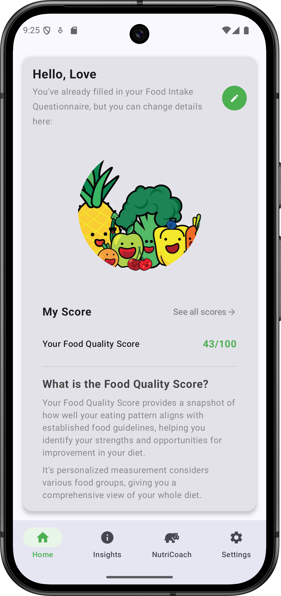
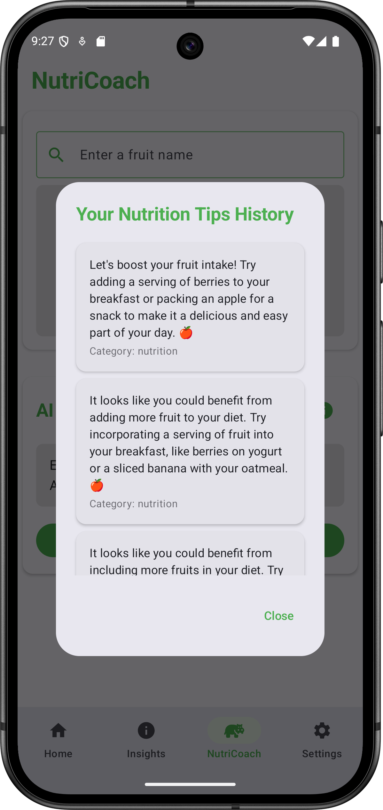
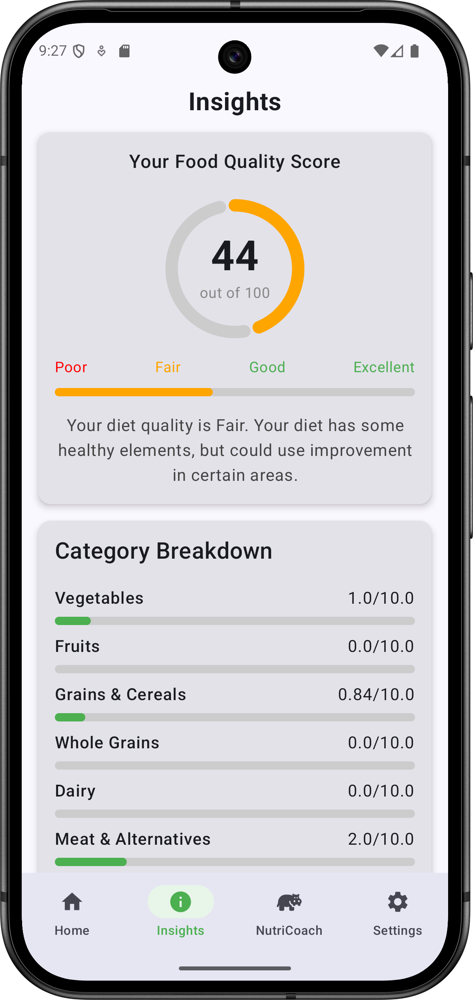
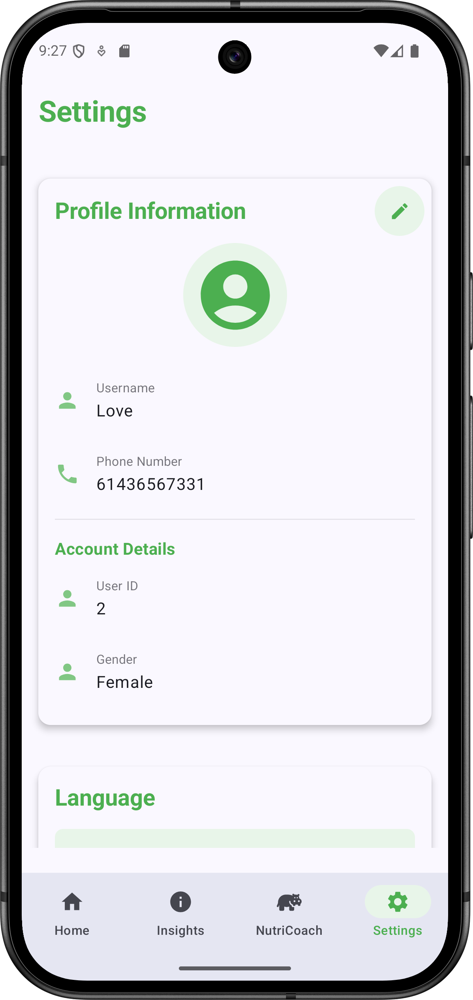

# NutriTrack - AI-Powered Nutrition Tracking & HEIFA Scoring App

<div align="center">


**A comprehensive Android nutrition tracking application with AI-powered coaching and professional HEIFA scoring system**

[](https://android.com)
[](https://kotlinlang.org)
[](https://developer.android.com/jetpack/compose)
[](https://ai.google.dev)

</div>

## 📱 Overview

NutriTrack is a sophisticated Android nutrition tracking application that combines modern mobile development with AI-powered insights. Built for both individual users and healthcare professionals, it implements the **Healthy Eating Index for Australian Adults (HEIFA)** scoring system and provides personalized nutrition coaching through Google Gemini AI integration.

## ✨ Key Features

### 🍎 **Comprehensive Nutrition Tracking**
- **HEIFA Scoring System**: Complete implementation of Australian dietary guidelines
- **60+ Nutrition Metrics**: Detailed tracking of vegetables, fruits, grains, proteins, dairy, and more
- **Real-time Score Calculation**: Instant feedback on dietary choices
- **Progress Visualization**: Charts and insights for nutrition trends

### 🤖 **AI-Powered Coaching**
- **Personalized Tips**: Google Gemini AI generates custom nutrition advice
- **Smart Recommendations**: Context-aware suggestions based on HEIFA scores
- **Natural Language Chat**: Ask nutrition questions and get expert responses
- **Fruit Database Integration**: Real-time nutrition facts via FruityVice API

### 🌐 **Multi-Language Support**
- **5 Languages**: English, French, Japanese, Chinese, Malay
- **Dynamic Translation**: AI-powered translation for seamless experience
- **Locale-Aware UI**: Automatic language detection and switching

### 👩‍⚕️ **Professional Features**
- **Clinician Dashboard**: Healthcare provider access with patient analytics
- **Population Health Insights**: Demographic-based nutrition comparisons
- **Evidence-Based Guidelines**: Built on Australian dietary recommendations
- **Secure Access**: Role-based authentication system

### 🎨 **Modern User Experience**
- **Material Design 3**: Beautiful, accessible interface
- **Jetpack Compose UI**: Smooth animations and responsive design
- **Dark/Light Themes**: Adaptive theming support
- **Offline Capability**: Local data storage for uninterrupted usage

## 🛠️ Technology Stack

### **Frontend**
- **Kotlin** - Primary programming language
- **Jetpack Compose** - Modern UI toolkit
- **Material Design 3** - Design system
- **Navigation Component** - Screen navigation

### **Backend & Data**
- **Room Database** - Local SQLite database
- **Retrofit** - REST API client
- **Coroutines** - Asynchronous programming
- **LiveData & StateFlow** - Reactive data handling

### **AI & External Services**
- **Google Gemini AI** - Personalized coaching and insights
- **FruityVice API** - Fruit nutrition database
- **Translation Services** - Multi-language support

### **Architecture**
- **MVVM Pattern** - Clean architecture separation
- **Repository Pattern** - Data layer abstraction
- **Dependency Injection** - Modular component design

## 📊 Database Schema

### Core Entities
- **Patient**: User profiles with comprehensive HEIFA nutrition data
- **FoodIntake**: Daily food consumption records
- **NutriCoachTip**: AI-generated nutrition tips with categorization
- **PatientFoodPreferences**: Dietary preferences and persona profiles

## 🚀 Getting Started

### Prerequisites
- Android Studio Arctic Fox or later
- Android SDK 35+
- Kotlin 1.9+
- Google Gemini API key

### Installation

1. **Clone the repository**
   ```bash
   git clone https://github.com/yourusername/nutritrack.git
   cd nutritrack
   ```

2. **Open in Android Studio**
   - Open Android Studio
   - Select "Open an existing project"
   - Navigate to the cloned directory

3. **Configure API Keys**
   
   Create a `local.properties` file in the root directory:
   ```properties
   GEMINI_API_KEY=your_gemini_api_key_here
   ```

4. **Build and Run**
   ```bash
   ./gradlew assembleDebug
   ```

### API Key Setup

#### Google Gemini AI
1. Visit [Google AI Studio](https://makersuite.google.com)
2. Create a new API key
3. Add the key to your `local.properties` file

## 📱 Screenshots

| Home Screen | NutriCoach | Insights | Settings | Clinician |
|-------------|------------|----------|----------| ----------|
|  |  |  |  | 


## 🏗️ Architecture Overview

```
app/
├── src/main/java/com/fit2081/ter_34857613/NutriTrack/
│   ├── MainActivity.kt                 # Main entry point
│   ├── model/
│   │   ├── api/                       # API services
│   │   ├── data/                      # Data classes
│   │   ├── database/                  # Room entities & DAOs
│   │   └── repository/                # Data repositories
│   ├── viewmodel/                     # Business logic
│   ├── ui/
│   │   ├── screens/                   # Composable screens
│   │   ├── components/                # Reusable UI components
│   │   └── theme/                     # Material theming
│   └── utils/                         # Utility classes
├── assets/                            # Sample nutrition data
└── res/                               # Resources & translations
```

## 🔧 Key Components

### ViewModels
- `GeminiViewModel` - AI interactions and insights generation
- `NutriCoachViewModel` - Personalized coaching features
- `QuestionnaireViewModel` - User assessment and preferences
- `InsightsViewModel` - Nutrition analytics and visualizations
- `SettingsViewModel` - User preferences and configuration

### Repositories
- `PatientRepository` - User data management
- `GeminiRepository` - AI service integration
- `FruitRepository` - External nutrition API
- `NutriCoachTipRepository` - Coaching data persistence

## 🧪 Testing

Run the test suite:
```bash
./gradlew test
./gradlew connectedAndroidTest
```

### Testing Technologies
- **JUnit** - Unit testing framework
- **Mockito** - Mocking for isolated tests
- **Espresso** - UI testing
- **Coroutines Test** - Async testing utilities

## 🌟 Features in Detail

### HEIFA Scoring System
The app implements the complete Healthy Eating Index for Australian Adults, tracking:
- **Vegetables**: 6 subcategories with variation scoring
- **Fruits**: 6 types with optimal intake recommendations
- **Grains**: Whole grain vs. refined grain analysis
- **Proteins**: Meat alternatives and legume allocation
- **Dairy**: Calcium and protein content assessment
- **Discretionary Foods**: Sugar, saturated fat, and sodium monitoring

### AI Integration
- **Contextual Coaching**: Tips based on individual HEIFA scores
- **Population Analysis**: Demographic health insights for clinicians
- **Natural Language Processing**: Nutrition Q&A capabilities
- **Multi-language AI**: Responses in user's preferred language

## 🤝 Contributing

We welcome contributions! Please see our [Contributing Guidelines](CONTRIBUTING.md) for details.

### Development Workflow
1. Fork the repository
2. Create a feature branch (`git checkout -b feature/AmazingFeature`)
3. Commit your changes (`git commit -m 'Add some AmazingFeature'`)
4. Push to the branch (`git push origin feature/AmazingFeature`)
5. Open a Pull Request

## 📄 License

This project is licensed under the MIT License - see the [LICENSE](LICENSE) file for details.

## 👥 Authors

- **Ter Jing Hao** - *Initial work* - [YourGitHub](https://github.com/JHTer)

## 🙏 Acknowledgments

- **Monash University** - Nutrition research and HEIFA methodology
- **Google Gemini AI** - AI-powered insights and coaching
- **FruityVice** - Fruit nutrition database
- **Android Jetpack** - Modern Android development tools

## 📞 Support

For support, create an issue in this repository.

---

<div align="center">
  <strong>Built with ❤️ for better nutrition and health</strong>
</div>
